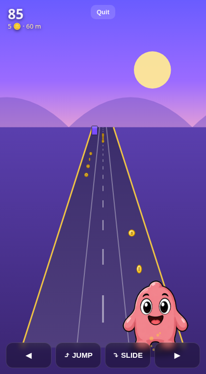

# Blobbie Dash 🏃‍♂️🪙

An endless **PvP runner** game (Subway-Surfers / Temple-Run style) starring the
**Blobbie** character. Players dash down a 3-lane track, jump and slide past
obstacles, and grab **$BLOBBIE** coins. Race a random rival for a prize pool,
challenge a friend with a room code, and climb the weekly tournament leaderboard.

Built to be **dropped into any website** as a single embeddable iframe.



---

## Features

- 🎮 **Endless runner** — pseudo-3D 3-lane track, jump / slide / lane-switch, ramping
  difficulty, coins, hurdles, overhead bars and walls. Keyboard + touch + on-screen controls.
- ⚡ **Ranked PvP (random)** — real-time matchmaking. Both players race the **exact same
  procedurally-generated track** (shared seed) so it's perfectly fair. Highest score
  (distance + coins) wins. Each player stakes a small **$BLOBBIE** entry fee and the
  **winner takes the prize pool**. Only these random matches count on the leaderboard.
- 🤝 **Play a friend** — create a private room and share a 4-letter code for a free, casual race.
- 🏆 **Leaderboard** — all-time and this-week rankings (random ranked runs only).
- 🎟️ **Weekly tournaments** — a growing prize pool (seeded base + 10% rake from every
  ranked match pot) is paid out automatically to the top runners when the week ends.
- 👛 **$BLOBBIE wallet** — every player gets a virtual balance to enter matches and win prizes.
- 🔌 **Embeddable** — responsive UI, works in an iframe on desktop & mobile.

> **Note on the economy:** `$BLOBBIE` balances, fees and prize pools are tracked in the
> game's own database as a self-contained virtual economy. There is no on-chain/wallet
> integration — that can be layered on later by replacing the balance functions in
> [`server/db.js`](server/db.js) with calls to a real token contract.

---

## Quick start

```bash
npm install
npm start
# open http://localhost:3000
```

The server (Express + Socket.IO) serves the game and the API on the same port.
Set a custom port with `PORT=8080 npm start`.

Player data, scores and tournaments are stored in a local SQLite database at
`data/blobbie.db` (created automatically, git-ignored).

---

## Embedding on your site

See [`public/embed-example.html`](public/embed-example.html) for a live demo. The short version:

```html
<div style="position:relative;width:100%;max-width:420px;margin:auto;aspect-ratio:9/16;
            border-radius:20px;overflow:hidden">
  <iframe src="https://YOUR-DOMAIN/" allow="autoplay; clipboard-write"
          style="position:absolute;inset:0;width:100%;height:100%;border:0"></iframe>
</div>
```

---

## How to play

| Action | Keyboard | Touch |
| --- | --- | --- |
| Change lane | ◀ ▶ / A · D | swipe left / right · on-screen ◀ ▶ |
| Jump (clear hurdles, grab arc coins) | ▲ / W / Space | swipe up / tap · JUMP button |
| Slide (duck under bars) | ▼ / S | swipe down · SLIDE button |

Walls can only be dodged by switching lanes. Score = distance + coins × value.

---

## Character assets (bring your own art) 🎨

The in-game runner, the win/lose result art and the menu avatar are all driven by
a **manifest of character pieces** so you can swap in your own art without touching
game code.

- Pieces live in [`public/assets/character/`](public/assets/character/), described by
  [`manifest.json`](public/assets/character/manifest.json) (groups: `top_full_body`,
  `middle_head`, `middle_pose`, `bottom_asset`). **Art is SVG** (vector scales crisply
  at any size and supports full transparency).
- Every piece ships with a **labeled placeholder SVG** at its exact export size, so the
  game runs out of the box. Open **`/assets/character/preview.html`** in a browser to see
  every piece, its name/size, and which game state it maps to.

**To use your own character:**

1. Export your pieces as **SVG** and drop them into `public/assets/character/svg/` using the
   **same file names** as in the manifest. If a piece is ever missing, the classic
   `blobbie1.png` mascot is the final fallback — so nothing breaks while you're mid-swap.
2. Choose which piece represents which game state by editing **`ROLES`** at the top of
   [`public/js/character.js`](public/js/character.js):

   | Role | Used for | Default |
   | --- | --- | --- |
   | `run` / `jump` / `slide` | the player while running | `middle_pose_01/02/06` |
   | `win` | victory / run-complete art | `top_full_body_02` |
   | `lose` | defeat art | `top_full_body_03` |
   | `idle` / `avatar` | menu avatar & countdown | `top_full_body_01` |

   All other pieces (extra heads, poses, `bottom_asset` props) are still loaded and
   available — point a role at them, or draw them directly with
   `Character.draw(ctx, 'middle_head_03', x, y, height)`.

### Running animation

The engine adds a **procedural run cycle** (vertical hop + squash/stretch + forward lean)
to the `run` pose, so even a *single* run SVG visibly "runs" — **no GIF needed** (and GIFs
don't work on canvas anyway: only their first frame is drawn).

Want a true hand-drawn run cycle? Export a few frames and make `run` an **array** — the
engine cycles them automatically:

```js
// public/js/character.js
const ROLES = {
  run: ['run_01', 'run_02', 'run_03', 'run_04'], // add run_0x.svg to assets/character/svg/
  // ...
};
```

To regenerate the placeholder SVGs after editing the manifest:

```bash
node scripts/gen-character-placeholders.js
```

## Project structure

```
server/
  index.js      Express + Socket.IO: REST API, matchmaking, PvP match flow
  db.js         SQLite: players, wallets, scores, tournaments, payouts
public/
  index.html    Game shell (all screens)
  css/styles.css
  js/
    shared.js     Deterministic PRNG + course generator (shared by both PvP clients & server)
    character.js  Manifest-driven character system + role mapping (run/jump/slide/win/lose/avatar)
    blobbie.js    Character renderer: Character pieces -> blobbie1.png sprite -> procedural fallback
    game.js       Pseudo-3D endless-runner engine (canvas)
    net.js        REST + Socket.IO client wrapper
    main.js       UI orchestration (screens, menus, matchmaking, results)
  assets/
    blobbie1.png            Mascot used for branding / fallback
    character/
      manifest.json         Character pieces (your art goes here)
      svg/                  Placeholder SVG art at each piece's export size
      preview.html          Gallery of all pieces + role mapping
  embed-example.html
scripts/
  gen-character-placeholders.js   Regenerate placeholder SVGs from the manifest
```

## API overview

REST (auth via `x-player-id` / `x-player-token` headers where noted):

- `POST /api/register` `{ username }` → `{ id, token, player }`
- `GET  /api/me` *(auth)* → `{ player }`
- `GET  /api/config` → fees / starting balance
- `GET  /api/leaderboard?scope=all|week` → top 50
- `GET  /api/tournament` → current pool, standings, prize split, payout history
- `POST /api/claim-bonus` *(auth)* → small top-up if balance is below the entry fee

Real-time (Socket.IO): `auth`, `queue:join` / `queue:leave` (ranked), `room:create` /
`room:join` (friends), `match:ready` / `match:progress` / `match:finish` / `match:forfeit`,
with server events `match:found`, `match:start`, `opponent:progress`, `match:result`, etc.

## License

MIT
