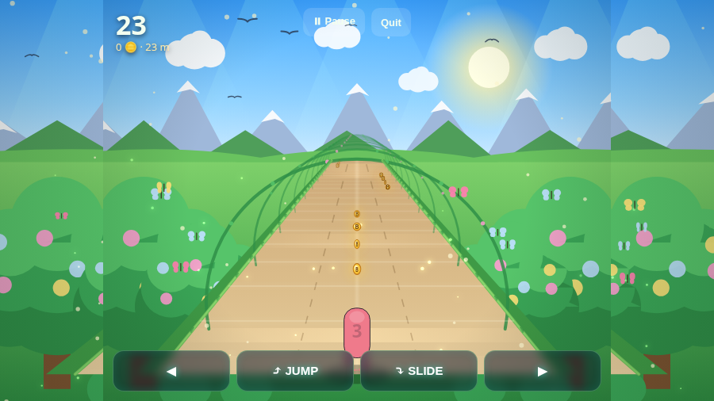
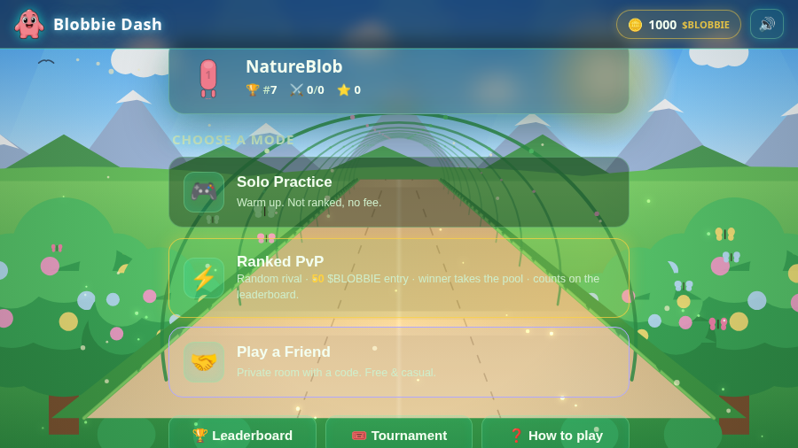

# Blobbie Dash 🏃‍♂️🪙

An endless **PvP runner** game (Subway-Surfers / Temple-Run style) starring the
**Blobbie** character. Players dash down a 3-lane track, jump and slide past
obstacles, and grab **$BLOBBIE** coins. Race a random rival for a prize pool,
challenge a friend with a room code, and climb the weekly tournament leaderboard.

Built to be **dropped into any website** as a single embeddable iframe.




---

## Features

- 🎨 **One-file theming** — edit [`public/theme.js`](public/theme.js) to recolor the UI and
  the whole game world, drop in texture images, or set an **animated GIF** as the gameplay
  background. (See "Theming & custom assets" below.)
- 🌳 **Fantastical nature world** — blue sky, a warm sun with soft rays, drifting clouds,
  snow-capped mountains, rolling green hills, and a winding earthy **path** lined with
  stylized trees and flowering vine archways. Obstacles are **nature props**: jump over
  rocks & logs, slide under leafy branches & vine arches, and dodge tall trees / boulders by
  switching lanes. Birds glide overhead, butterflies and fireflies drift by the path.
- 🔊 **Sound & music** — a fully synthesized (Web Audio) sound engine: jump/slide/coin/crash
  SFX, win/lose stings, countdown beeps, and a looping synthwave track. Mute toggle in the
  top bar. No audio files to ship.
- 🎮 **Endless runner** — pseudo-3D 3-lane track, jump / slide / lane-switch, ramping
  difficulty, coins, hurdles, overhead bars and walls. Keyboard + touch + on-screen controls.
- ⚡ **Ranked PvP (random)** — real-time matchmaking. Both players race the **exact same
  procedurally-generated track** (shared seed) so it's perfectly fair. Highest score
  (distance + coins) wins. Each player stakes a small **$BLOBBIE** entry fee and the
  **winner takes the prize pool**. Only these random matches count on the leaderboard.
- 🤝 **Play a friend** — create a private room and share a 4-letter code for a free, casual race.
- 🏆 **Leaderboard** — all-time and this-week rankings (random ranked runs only).
- 🎟️ **Weekly tournaments** — a growing prize pool (seeded base + 10% rake from every
  ranked match pot) is paid out automatically to the top runners when the week ends.
- 👛 **$BLOBBIE wallet** — every player gets a virtual balance to enter matches and win prizes.
- 🔌 **Embeddable** — responsive UI, works in an iframe on desktop & mobile.

> **Note on the economy:** `$BLOBBIE` balances, fees and prize pools are tracked in the
> game's own database as a self-contained virtual economy. There is no on-chain/wallet
> integration — that can be layered on later by replacing the balance functions in
> [`server/db.js`](server/db.js) with calls to a real token contract.

---

## Quick start

```bash
npm install
npm start
# open http://localhost:3000
```

The server (Express + Socket.IO) serves the game and the API on the same port.
Set a custom port with `PORT=8080 npm start`.

Player data, scores and tournaments are stored in a local SQLite database at
`data/blobbie.db` (created automatically, git-ignored).

---

## Embedding on your site

See [`public/embed-example.html`](public/embed-example.html) for a live demo. The short version:

```html
<div style="position:relative;width:100%;max-width:420px;margin:auto;aspect-ratio:9/16;
            border-radius:20px;overflow:hidden">
  <iframe src="https://YOUR-DOMAIN/" allow="autoplay; clipboard-write"
          style="position:absolute;inset:0;width:100%;height:100%;border:0"></iframe>
</div>
```

---

## How to play

| Action | Keyboard | Touch |
| --- | --- | --- |
| Change lane | ◀ ▶ / A · D | swipe left / right · on-screen ◀ ▶ |
| Jump (clear hurdles, grab arc coins) | ▲ / W / Space | swipe up / tap · JUMP button |
| Slide (duck under bars) | ▼ / S | swipe down · SLIDE button |

Walls can only be dodged by switching lanes. Score = distance + coins × value.

---

## Character animations (bring your own art) 🎨

The in-game runner is **frame-animated** from SVG sequences, so you can drop in your own
art without touching game code. There are **5 animations** (all SVG, in
[`public/assets/character/svg/`](public/assets/character/svg/), listed in
[`manifest.json`](public/assets/character/manifest.json)):

| Animation | Trigger | Frames | Playback |
| --- | --- | --- | --- |
| **run** | default (no key) | `run_back_frame_01..08` | loops forever |
| **jump** | UP key | `jump_back_frame_01..06` | one-shot ping-pong |
| **slide** | DOWN key | `jump_slide_sit_mix_back_frame_01..06` | one-shot ping-pong |
| **move left** | LEFT key | `move_left_back_frame_01..06` | one-shot ping-pong |
| **move right** | RIGHT key | `move_right_back_frame_01..06` | one-shot ping-pong |

**Ping-pong one-shot** = on a key press the animation plays frame `1 → last`, then smoothly
back `last → 1`, and then control returns to the looping **run** animation. (Implemented by
`Character.Animator` in [`public/js/character.js`](public/js/character.js).)

The result/menu art reuses frames via static **roles**: `avatar`/`idle` → `run_back_frame_01`,
`win` → `jump_back_frame_06`, `lose` → `jump_slide_sit_mix_back_frame_06`.

**To use your own art:**

1. Replace each SVG in `public/assets/character/svg/` with your own SVG of the **same file
   name**. The game loads strictly by these names. Aspect ratio is read from each SVG, so
   your art is never distorted. (If a frame is missing, the `blobbie1.png` mascot is the
   final fallback — nothing breaks while you swap.)
2. To change frame counts, timing (`fps`), or the loop/ping-pong behaviour, edit `ANIM` at
   the top of `public/js/character.js`. Then regenerate placeholders if you changed the
   counts:

   ```bash
   node scripts/gen-character-placeholders.js
   ```

Open **`/assets/character/preview.html`** to see every frame and the input → animation map.

## Theming & custom assets 🎨

Restyle the whole game from one file: [`public/theme.js`](public/theme.js). Edit the
colors there and the **UI** (buttons / text / page background) and the **canvas world**
(sky, ground, road/path, mountains, trees, coins, obstacles) update automatically — no other
code to touch. Anything you omit falls back to the built-in default.

**Texture images** — drop files in [`public/assets/textures/`](public/assets/textures/) and
point to them in `theme.world.textures` (`sky`, `ground`, `road`):

```js
world: { textures: { sky: 'assets/textures/sky.png', ground: 'assets/textures/grass.png', road: 'assets/textures/road.png' } }
```

**Gameplay background image / animated GIF** — drop an image or **GIF** in
[`public/assets/backgrounds/`](public/assets/backgrounds/) and set:

```js
gameplayBackground: 'assets/backgrounds/world.gif',
gameplayBackgroundMode: 'cover', // or 'contain'
```

When set, your image/GIF becomes the world backdrop (menu + gameplay) and **animates**; the
engine draws only the road/path + props on top so the runner keeps working.

## Project structure

```
server/
  index.js      Express + Socket.IO: REST API, matchmaking, PvP match flow
  db.js         SQLite: players, wallets, scores, tournaments, payouts
public/
  index.html    Game shell (all screens)
  theme.js      ⭐ Editable theme & assets (UI + world colors, textures, GIF backdrop)
  css/styles.css
  js/
    shared.js      Deterministic PRNG + course generator (shared by both PvP clients & server)
    character.js   Frame animation system: 5 animations + Animator (run/jump/slide/left/right)
    blobbie.js     Character renderer: animation frame -> blobbie.svg/png -> procedural fallback
    underwater.js  Shared nature world renderer (sky/mountains/path/trees) — reads theme.js
    game.js        Pseudo-3D runner engine (canvas) — drives the Animator; reads theme colors
    audio.js       Synthesized Web Audio sound engine (SFX + looping music + mute)
    background.js  Menu background driver (uses the shared world renderer)
    net.js         REST + Socket.IO client wrapper
    main.js        UI orchestration (screens, menus, matchmaking, results, theme apply)
  assets/
    blobbie1.png / blobbie.svg   Mascot used for branding / fallback
    character/      animation frames (your SVG art) + preview.html
    textures/       drop sky/ground/road texture images here (see README)
    backgrounds/    drop a gameplay background image or GIF here (see README)
  embed-example.html
scripts/
  gen-character-placeholders.js   Regenerate manifest + placeholder SVGs (the 5 animations)
```

## API overview

REST (auth via `x-player-id` / `x-player-token` headers where noted):

- `POST /api/register` `{ username }` → `{ id, token, player }`
- `GET  /api/me` *(auth)* → `{ player }`
- `GET  /api/config` → fees / starting balance
- `GET  /api/leaderboard?scope=all|week` → top 50
- `GET  /api/tournament` → current pool, standings, prize split, payout history
- `POST /api/claim-bonus` *(auth)* → small top-up if balance is below the entry fee

Real-time (Socket.IO): `auth`, `queue:join` / `queue:leave` (ranked), `room:create` /
`room:join` (friends), `match:ready` / `match:progress` / `match:finish` / `match:forfeit`,
with server events `match:found`, `match:start`, `opponent:progress`, `match:result`, etc.

## License

MIT
